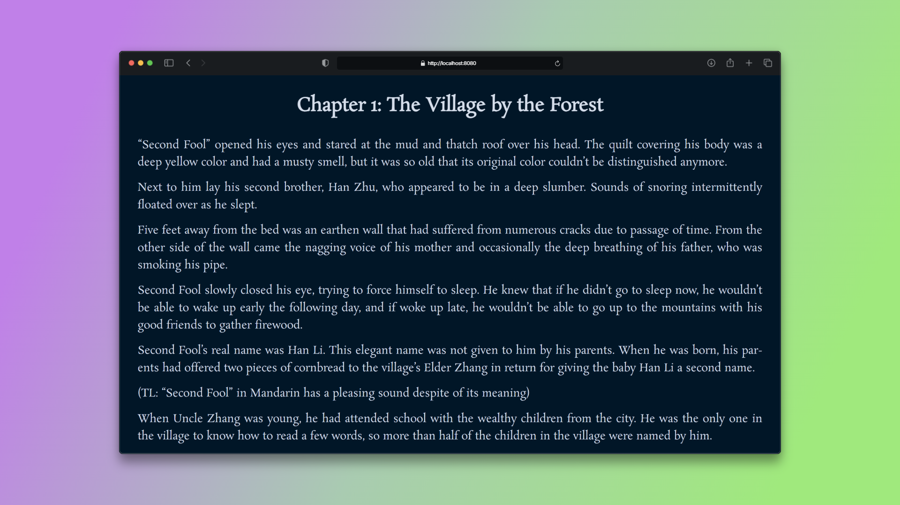
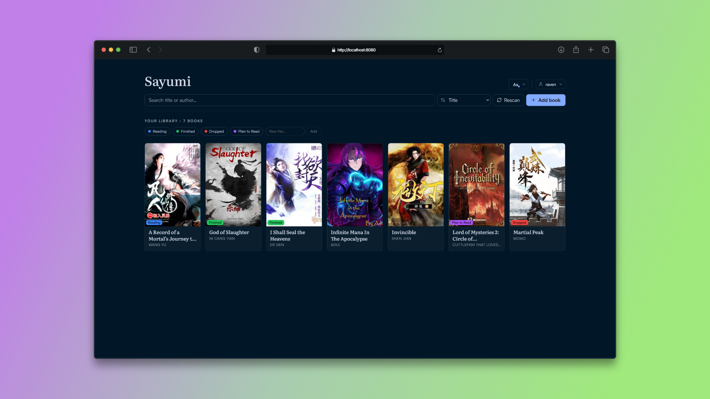

# Sayumi

Sayumi is a portable, local-first EPUB reader. It ships as a single Go binary with an embedded Svelte 5 web app that opens in your browser. There are no online accounts and no required cloud services: your library, reading progress, and settings live in plain folders next to the binary.

## Screenshots

Reading view:



Library view:



## Features

### Reading

- Custom EPUB renderer that runs each chapter inside a sandboxed iframe, isolated from the app shell.
- Three layout modes: continuous scroll, single page, and two-page spread.
- Table of contents, in-book full-text search with match highlighting, and bookmarks.
- Per-book reading progress stored as an EPUB CFI, with a save-on-exit beacon so your place is never lost.
- Right-to-left and vertical writing modes, following each book's own metadata.
- Reader chrome that hides itself while you read and returns on demand.

### Typography and themes

- Two reading fonts built into the binary: Literata (serif) and Atkinson Hyperlegible Next (sans-serif).
- Drop-in font families from a `Fonts` folder, including variable fonts, with per-role file mapping for regular, bold, italic, and bold italic (Total 29 Reading fonts bundled).
- Text controls for font size, line height, paragraph spacing, paragraph indent, font weight, justification, and hyphenation.
- Independent letter-spacing controls for body text and for headings.
- Dedicated chapter-title controls: alignment, size, weight, and per-heading sizing.
- Code blocks fall back to the browser's monospace font instead of the reading font.
- Optional "use the book's own fonts" mode that keeps the publisher's styling.
- A built-in type specimen page for tuning settings against real sample text.
- 25 light and dark themes, including Solarized, Nord, Dracula, Gruvbox, Catppuccin, Tokyo Night, Rosé Pine, Everforest, Flexoki, and Kanagawa.
- The ability to create your own custom themes.

### Library

- Drag-and-drop upload, or drop `.epub` files straight into the `Library` folder and rescan.
- Cover art, with the option to replace a cover from your own image.
- Editable book metadata such as title and author.
- Search, sort, and filter across the library.
- Flairs: custom status tags you can assign to books.
- One-click local download of the original `.epub`.
- Optional anonymous share link through gofile.io, the only outbound network request the app makes, and only when you ask for it.

### Profiles

- Multiple profiles, each with its own library, progress, settings, and theme.
- Optional per-profile PIN.
- Create, clone, and delete profiles from inside the app.
- Remember-me sessions that survive a server restart.

### Interface

- Command palette (Ctrl/Cmd + K) for fast navigation and actions.
- Keyboard shortcuts throughout, with an overlay you can open by pressing `?`.
- Offline banner and toast notifications.

## Quick start

- Download the correct executable for your PC from the release page: https://github.com/HongYue1/sayumi/releases/latest
- Launch the executable normally

Add books by dropping `.epub` files into the `Library` folder next to the binary, or by uploading them in the app. Extra reading fonts go in the `Fonts` folder next to the binary; see the README inside that folder for the expected layout.

## Usage

```sh
sayumi [flags]
```

| Flag          | Default     | Description                                           |
| ------------- | ----------- | ----------------------------------------------------- |
| `-port`       | `8080`      | Port to listen on.                                    |
| `-library`    | `./Library` | Path to the library root directory.                   |
| `-fonts`      | `./Fonts`   | Path to the user fonts directory.                     |
| `-network`    | `false`     | Allow LAN access by binding to `0.0.0.0`.             |
| `-debug`      | `false`     | Enable verbose debug logging.                         |
| `-version`    |             | Print version and exit.                               |
| `-pprof`      | `false`     | Expose `net/http/pprof` on localhost for diagnostics. |
| `-pprof-port` | `6060`      | Port for the localhost-only pprof server.             |
| `-cpuprofile` |             | Write a CPU profile to the given file.                |
| `-trace`      |             | Write an execution trace to the given file.           |

The library path can also be set with the `SAYUMI_LIBRARY` environment variable. While the server is running, press `n` to toggle LAN access and `q` to quit.

## Development

```sh
make build        # local optimized build (auto GOAMD64=v3 when supported)
make run          # build, then run
make check        # all gates: format, vet, lint, vulncheck, tests, svelte-check
make fix          # auto-fix pass: imports, formatting, lint --fix, mod tidy
make release      # cross-compiled, portable archives in dist-release/
```

Frontend dev server, which proxies the API to a binary running on port 8080:

```sh
cd frontend && bun install && bun run dev
```

The quality gates use gofumpt and goimports for formatting, golangci-lint and `go vet` for static analysis, govulncheck for known vulnerabilities, `go test` for the backend, and svelte-check plus vitest for the frontend. Install the Go tools once:

```sh
go install github.com/golangci/golangci-lint/v2/cmd/golangci-lint@v2.12.2
go install golang.org/x/vuln/cmd/govulncheck@v1.3.0
go install mvdan.cc/gofumpt@v0.10.0
go install golang.org/x/tools/cmd/goimports@v0.46.0
```

## Project layout

```
cmd/sayumi/     package main: HTTP server and the embedded frontend (go:embed dist)
internal/       api, epub parsing, library, storage (SQLite), fonts
frontend/       Svelte 5 and Vite app, builds into cmd/sayumi/dist
fonts-bundle/   drop-in reading fonts shipped in releases as ./Fonts/
docs/           screenshots and other documentation assets
```

## How it works

The backend is plain Go on the standard library HTTP router, storing data in per-profile SQLite databases through the CGO-free `modernc.org/sqlite` driver, so the binary builds and runs without a C toolchain. The frontend is a Svelte 5 single-page app built by Vite and embedded into the binary with `go:embed`, which is why a release is a single file with nothing to install. EPUB files are parsed on the server, and each chapter is rendered inside a sandboxed iframe on the client for isolation.

## Requirements

- Go 1.26.5 or newer
- bun (or npm) for building the frontend
