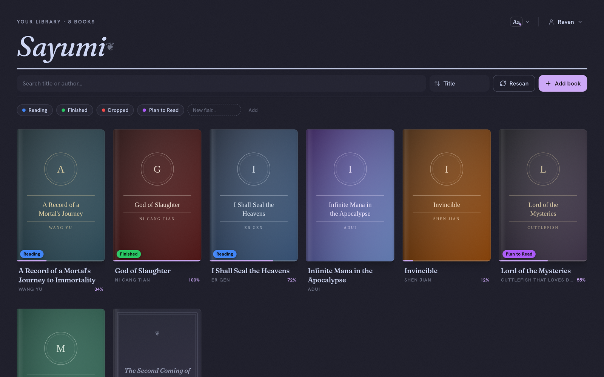

# Sayumi

[](https://github.com/HongYue1/sayumi/actions/workflows/ci.yml)
[](https://github.com/HongYue1/sayumi/releases/latest)

Sayumi is a portable, local-first EPUB reader. It ships as a single Go binary with an embedded Svelte 5 web app that opens in your browser. There are no accounts and no required cloud services: your library, reading progress, and settings live in plain folders next to the binary.

## Screenshots

Reading view:


Library view:



## Features

### Reading

- Custom EPUB renderer; each chapter runs inside a sandboxed iframe, isolated from the app shell.
- Three layout modes: continuous scroll, single page, and two-page spread.
- Table of contents, full-text search with match highlighting, and bookmarks with notes.
- Reading position stored as an EPUB CFI, with a save-on-exit beacon so your place survives closed tabs.
- Right-to-left and vertical writing modes, following each book's own metadata.
- Reader chrome that hides itself while you read and returns on demand.

### Typography and themes

- 29 bundled reading fonts, plus drop-in support for your own families — including variable fonts — from a `Fonts` folder, with per-role file mapping (regular, bold, italic, bold italic).
- Full text controls: font size, line height, paragraph spacing, indent, weight, justification, and hyphenation.
- Independent letter-spacing for body text and headings, and dedicated chapter-title controls (alignment, size, weight, per-heading sizing).
- An optional "use the book's own fonts" mode that preserves the publisher's styling; code blocks always fall back to monospace.
- A built-in type specimen page for tuning settings against realistic sample text.
- 25 light and dark themes drawn from canonical palettes — Solarized, Nord, Dracula, Gruvbox, Catppuccin, Tokyo Night, Rosé Pine, Everforest, Flexoki, Kanagawa, and more — plus custom theme creation.

### Library

- Drag-and-drop import, or drop `.epub` files into the `Library` folder and rescan.
- Cover art extraction, with the option to replace any cover from your own image.
- Editable metadata, library-wide search, sorting, and filtering.
- Flairs: custom status tags you can assign to books.
- One-click download of the original `.epub`, and an optional anonymous share link via gofile.io — the only outbound request the app ever makes, and only when you ask for it.

### Profiles and interface

- Multiple profiles, each with its own library, progress, settings, and theme; optional per-profile PIN; remember-me sessions that survive restarts.
- Command palette (<kbd>Ctrl</kbd>/<kbd>Cmd</kbd> + <kbd>K</kbd>) for fast navigation and actions.
- Keyboard shortcuts throughout — press <kbd>?</kbd> for the overview.
- Offline detection with graceful degradation.

## Getting started

1. Download the executable for your platform from the [latest release](https://github.com/HongYue1/sayumi/releases/latest).
2. Run it. Your browser opens the app at `http://127.0.0.1:8080`.
3. Add books by uploading them in the app, or by dropping `.epub` files into the `Library` folder created next to the binary.

Additional reading fonts go in the `Fonts` folder next to the binary; releases include a `Fonts/README.txt` describing the expected layout.

## Usage

```sh
sayumi [flags]
```

| Flag          | Default     | Description                                           |
| ------------- | ----------- | ----------------------------------------------------- |
| `-port`       | `8080`      | Port to listen on.                                    |
| `-library`    | `./Library` | Path to the library root directory.                   |
| `-fonts`      | `./Fonts`   | Path to the user fonts directory.                     |
| `-network`    | `false`     | Allow LAN access by binding to `0.0.0.0`.             |
| `-debug`      | `false`     | Enable verbose debug logging.                         |
| `-version`    |             | Print version and exit.                               |
| `-pprof`      | `false`     | Expose `net/http/pprof` on localhost for diagnostics. |
| `-pprof-port` | `6060`      | Port for the localhost-only pprof server.             |
| `-cpuprofile` |             | Write a CPU profile to the given file.                |
| `-trace`      |             | Write an execution trace to the given file.           |

The library path can also be set with the `SAYUMI_LIBRARY` environment variable. While the server is running, type `n` to toggle LAN access and `q` to quit.

## Development

Building from source requires Go 1.26.5+ and bun (or npm) for the frontend.

```sh
make build        # local optimized build (auto GOAMD64=v3 when supported)
make run          # build, then run
make check        # all quality gates: format, vet, lint, vulncheck, tests, svelte-check
make fix          # auto-fix pass: imports, formatting, lint --fix, mod tidy
make release      # cross-compiled, portable archives in dist-release/
```

For frontend work, run a dev server that proxies the API to a binary listening on port 8080:

```sh
cd frontend && bun install && bun run dev
```

The quality gates use gofumpt and goimports for formatting, golangci-lint and `go vet` for static analysis, govulncheck for known vulnerabilities, `go test` for the backend, and svelte-check plus vitest for the frontend. Install the Go tools once:

```sh
go install github.com/golangci/golangci-lint/v2/cmd/golangci-lint@v2.12.2
go install golang.org/x/vuln/cmd/govulncheck@v1.3.0
go install mvdan.cc/gofumpt@v0.10.0
go install golang.org/x/tools/cmd/goimports@v0.46.0
```

## Architecture

The backend is plain Go on the standard-library HTTP router, storing data in per-profile SQLite databases through the CGO-free `modernc.org/sqlite` driver — the binary builds and runs without a C toolchain. The frontend is a Svelte 5 single-page app built by Vite and embedded with `go:embed`, which is why a release is one file with nothing to install. EPUB files are parsed and sanitized on the server; each chapter renders inside a sandboxed iframe on the client.

```
cmd/sayumi/     package main: HTTP server and the embedded frontend (go:embed dist)
internal/       api, epub parsing, library scanning, storage (SQLite), bundled fonts
frontend/       Svelte 5 + Vite app; builds into cmd/sayumi/dist
fonts-bundle/   drop-in reading fonts shipped in releases as ./Fonts/
docs/           screenshots and other documentation assets
```
